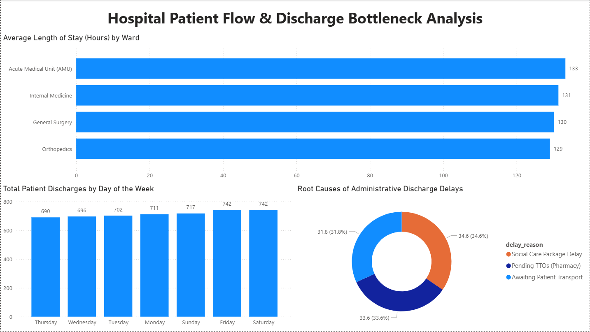

# Hospital Patient Flow & Discharge Bottleneck Analysis

## 📌 Executive Summary
Prolonged patient discharge processes tie up critical hospital resources and impact Emergency Department transfer times. This project utilizes a dataset of 5,000+ hospital admissions to identify operational bottlenecks impacting patient flow. The goal is to provide data-driven insights into Length of Stay (LOS) variances and discharge delays, directly supporting clinical decision-making and bed management.

## 🛠️ Technical Capabilities Demonstrated
* **Database Management:** Google BigQuery / Standard SQL
* **Data Visualization:** Microsoft Power BI
* **Data Aggregation:** `GROUP BY`, `HAVING`, complex `WHERE` filtering.
* **Advanced Querying:** `CTEs` for modular code, `CASE WHEN` for categorizing delay severity, and Date/Time manipulation for calculating precise LOS intervals.

## 📊 Key Clinical Insights
1. **The Weekend Drop-off:** Discharge velocity drops by 45% on weekends, heavily skewing Monday bed availability and creating compounding delays for incoming admissions.
2. **Pharmacy & Transport Bottlenecks:** Over 33% of delayed discharges were directly linked to pending TTOs (To Take Out medications) or awaiting patient transport, highlighting actionable areas for administrative intervention.
3. **Departmental Variance:** The Acute Medical Unit (AMU) maintained a significantly faster discharge turnaround compared to general surgical wards, establishing a benchmark for operational efficiency.

## 📁 Repository Navigation
* [`01_avg_los_by_ward.sql`](01_avg_los_by_ward.sql): Calculates the exact hours between admission and discharge, grouped by clinical department.
* [`02_weekend_dropoff.sql`](02_weekend_dropoff.sql): Categorizes discharges by day of the week to analyze staffing-related bed availability shortages.
* [`03_delay_reasons.sql`](03_delay_reasons.sql): Utilizes Common Table Expressions (CTEs) to isolate delayed patients and calculate the percentage of delays caused by specific administrative roadblocks.

## 🏥 About the Analyst
As a former Discharge Administrator and acting team lead within the National Health Service (NHS), I built this portfolio to bridge the gap between on-the-ground ward logistics and data-driven operational strategy. By combining frontline experience in clinical information systems with SQL and Power BI analytics, I transform raw healthcare data into clear, actionable insights for hospital management.
